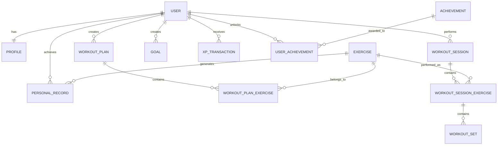

# GymRats — Database Design

## 1. Purpose

This document describes the initial data model for GymRats.

The goal is to define the main entities, relationships and data responsibilities before implementing the database.

The model is expected to evolve during development.

---

# 2. Main Entities

The initial MVP contains the following main entities:

- User
- Profile
- Exercise
- WorkoutPlan
- WorkoutPlanExercise
- WorkoutSession
- WorkoutSessionExercise
- WorkoutSet
- PersonalRecord
- Goal
- Achievement
- UserAchievement
- XPTransaction

---

# 3. User

Represents an authenticated GymRats account.

Possible attributes:

```text
User
-------------------------
id
email
password_hash
created_at
updated_at
```

Responsibilities:

- authentication;
- account ownership;
- relation with workouts;
- relation with goals;
- relation with gamification data.

Passwords must never be stored in plain text.

---

# 4. Profile

Stores public and fitness-related information about the user.

```text
Profile
-------------------------
id
user_id
username
bio
profile_image
training_experience
current_level
total_xp
created_at
updated_at
```

Relationship:

```text
User 1 ───── 1 Profile
```

Each user has one profile.

Separating `User` and `Profile` helps keep authentication data separated from application profile information.

---

# 5. Exercise

Represents an exercise available in GymRats.

```text
Exercise
-------------------------
id
name
muscle_group
equipment
category
created_by
is_custom
created_at
```

Examples:

```text
Bench Press
Squat
Deadlift
Incline Dumbbell Press
Lat Pulldown
```

Some exercises are provided by GymRats.

Users may also create custom exercises.

`created_by` may be null for official exercises.

---

# 6. WorkoutPlan

Represents a reusable workout routine created by a user.

```text
WorkoutPlan
-------------------------
id
user_id
name
description
created_at
updated_at
```

Example:

```text
Push Day
Pull Day
Leg Day
Upper Body
```

Relationship:

```text
User 1 ───── N WorkoutPlan
```

A user can create multiple workout plans.

---

# 7. WorkoutPlanExercise

A workout plan may contain multiple exercises, and the same exercise may appear in multiple workout plans.

Therefore, this relationship is many-to-many.

```text
WorkoutPlanExercise
-------------------------
id
workout_plan_id
exercise_id
exercise_order
planned_sets
planned_repetitions
notes
```

Relationship:

```text
WorkoutPlan N ───── N Exercise
```

Implemented using:

```text
WorkoutPlanExercise
```

Example:

```text
Push Day
   ↓
Bench Press
Incline Dumbbell Press
Shoulder Press
Lateral Raise
```

---

# 8. WorkoutSession

Represents an actual workout performed by the user.

A workout plan is a template.

A workout session represents what actually happened.

```text
WorkoutSession
-------------------------
id
user_id
workout_plan_id
started_at
finished_at
duration
notes
status
created_at
```

Possible status values:

```text
active
completed
cancelled
```

Relationship:

```text
User 1 ───── N WorkoutSession
```

A workout session may reference a workout plan.

However, users may eventually be allowed to start workouts without a predefined plan.

Therefore:

```text
workout_plan_id
```

may be optional.

---

# 9. WorkoutSessionExercise

Represents an exercise performed during a workout session.

```text
WorkoutSessionExercise
-------------------------
id
workout_session_id
exercise_id
exercise_order
notes
```

Relationship:

```text
WorkoutSession 1 ───── N WorkoutSessionExercise
```

and:

```text
Exercise 1 ───── N WorkoutSessionExercise
```

This allows users to modify the workout while training without changing the original workout plan.

---

# 10. WorkoutSet

Represents an individual set performed during an exercise.

```text
WorkoutSet
-------------------------
id
workout_session_exercise_id
set_number
weight
repetitions
is_completed
created_at
```

Example:

```text
Bench Press

Set 1 → 80 kg × 10
Set 2 → 80 kg × 9
Set 3 → 75 kg × 10
```

Relationship:

```text
WorkoutSessionExercise 1 ───── N WorkoutSet
```

---

# 11. PersonalRecord

Stores personal record events achieved by users.

```text
PersonalRecord
-------------------------
id
user_id
exercise_id
workout_session_id
record_type
record_value
achieved_at
```

Possible record types:

```text
max_weight
max_repetitions
max_volume
estimated_1rm
```

Example:

```text
Bench Press
max_weight
92.5 kg
```

Relationship:

```text
User 1 ───── N PersonalRecord

Exercise 1 ───── N PersonalRecord
```

Keeping personal record events allows GymRats to display the evolution of a user's records over time.

---

# 12. Goal

Represents personal objectives created by users.

```text
Goal
-------------------------
id
user_id
type
title
target_value
current_value
period
start_date
end_date
status
created_at
```

Possible periods:

```text
daily
weekly
monthly
yearly
custom
```

Possible status values:

```text
active
completed
failed
cancelled
```

Example:

```text
Complete 4 workouts this week

target_value = 4
current_value = 3
period = weekly
```

Relationship:

```text
User 1 ───── N Goal
```

---

# 13. Achievement

Represents achievements available inside GymRats.

```text
Achievement
-------------------------
id
name
description
category
xp_reward
created_at
```

Examples:

```text
First Workout

Complete your first workout.

---

50 Workouts

Complete 50 workout sessions.

---

Consistency I

Complete your weekly training goal
for four consecutive weeks.
```

Achievements are created by GymRats rather than individual users.

---

# 14. UserAchievement

Users may unlock many achievements.

The same achievement may be unlocked by many users.

Therefore, this is a many-to-many relationship.

```text
UserAchievement
-------------------------
id
user_id
achievement_id
unlocked_at
```

Relationship:

```text
User N ───── N Achievement
```

Implemented using:

```text
UserAchievement
```

---

# 15. XPTransaction

Instead of storing only the user's total XP, GymRats should maintain a history of XP transactions.

```text
XPTransaction
-------------------------
id
user_id
amount
source_type
source_id
description
created_at
```

Example:

```text
+100 XP
Workout completed

+50 XP
Personal record

+200 XP
Weekly goal completed
```

Relationship:

```text
User 1 ───── N XPTransaction
```

The XP history helps with:

- debugging;
- auditing;
- dashboards;
- preventing duplicated rewards;
- understanding how users earned XP.

The total XP may be calculated from transactions or cached in the user's profile for performance.

---

# 16. Initial Entity Relationship Diagram

GitHub supports Mermaid diagrams, allowing the data model to be documented directly inside the repository.



---

# 17. Simplified Relationship Overview

```text
User
 │
 ├── Profile
 │
 ├── Workout Plans
 │      │
 │      └── Exercises
 │
 ├── Workout Sessions
 │      │
 │      └── Session Exercises
 │              │
 │              └── Sets
 │
 ├── Personal Records
 │
 ├── Goals
 │
 ├── XP Transactions
 │
 └── Achievements
```

---

# 18. Important Design Decision

Workout plans and workout sessions must remain separate.

Example:

The user creates:

```text
Push Day

Bench Press
Shoulder Press
Lateral Raise
```

During today's workout, the user decides to add:

```text
Triceps Extension
```

This should modify only today's workout session.

The original `Push Day` template should remain unchanged unless the user explicitly chooses to update it.

Therefore:

```text
WorkoutPlan
```

represents what the user intends to do.

While:

```text
WorkoutSession
```

represents what the user actually did.

---

# 19. Derived Data

Some information should not necessarily require dedicated database fields.

Examples:

```text
Workout duration

finished_at - started_at
```

```text
Training volume

weight × repetitions
```

```text
Workout count

COUNT(workout_sessions)
```

```text
Current XP

SUM(xp_transactions.amount)
```

These values can be calculated from existing data.

Some may later be cached if performance becomes important.

---

# 20. Future Social Entities

Social features will introduce additional entities such as:

```text
Friendship

Challenge

ChallengeParticipant

Community

CommunityMember

Post

Comment

Like
```

These entities will be modeled when the social system begins development.

---

# 21. Future Health Entities

Health-related information should remain separated from the main training domain.

Possible future entities include:

```text
HealthMetric

HealthMeasurement

BodyMeasurement

HealthDocument
```

Example:

```text
HealthMetric
-------------------------
id
name
unit
```

```text
HealthMeasurement
-------------------------
id
user_id
metric_id
value
measured_at
```

Health information must remain private by default and will require additional security and privacy considerations.

---

# 22. Current Database Scope

The initial database implementation should focus on:

```text
User
Profile
Exercise
WorkoutPlan
WorkoutPlanExercise
WorkoutSession
WorkoutSessionExercise
WorkoutSet
PersonalRecord
Goal
Achievement
UserAchievement
XPTransaction
```

Social and health entities should not be implemented until the corresponding features enter development.
